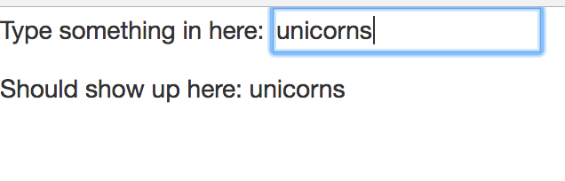

# text-auto-update

## Getting Started
```
  $ git clone https://github.com/johnazre/text-auto-update.git
  $ cd text-auto-update
```

## Base Goal
 - Look at the HTML. You'll see that you have a text box inside of a p tag on the top and a p tag with some text and a span tag below. Inside of the span tag, have the same text value as the input box above it.

 - You don't need to change anything in the HTML page. Just use the ids that are provided.



#### Suggestion
 - Research jquery's "input" event listener.
